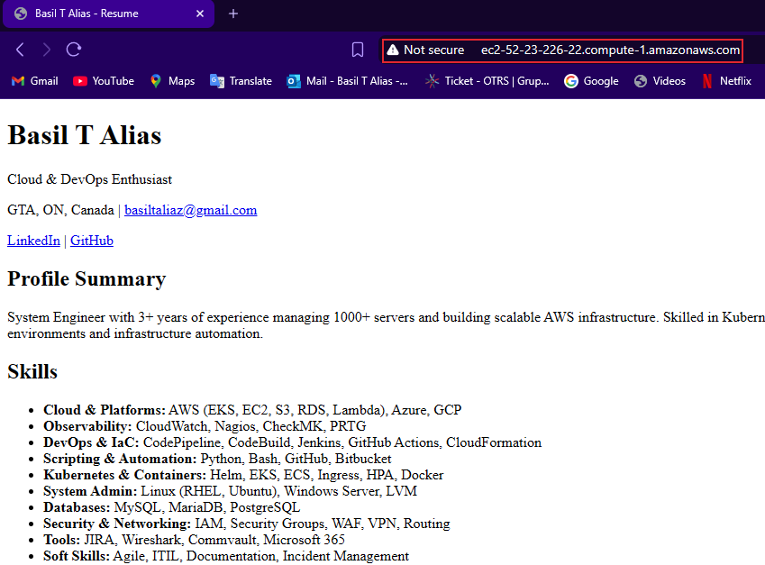
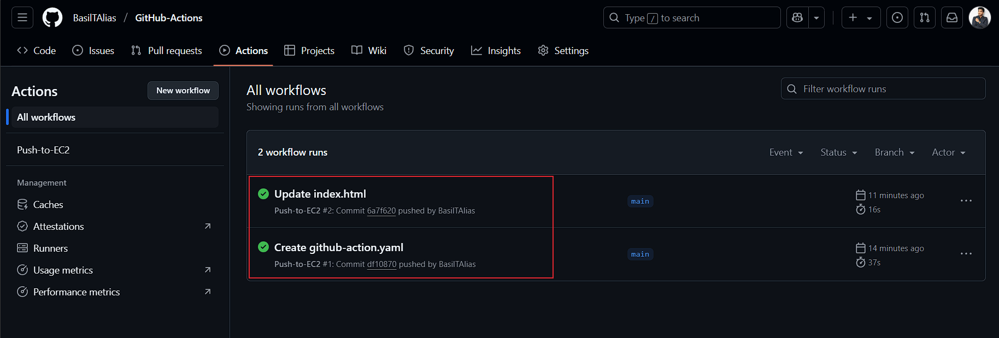
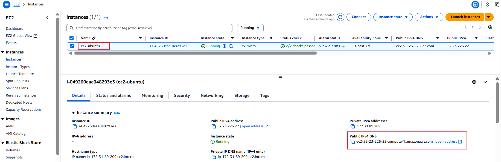
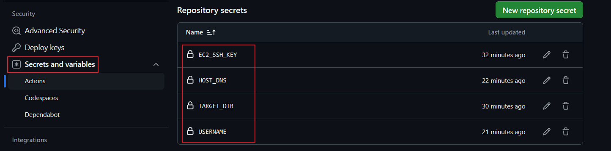

# 🚀 Host Your Resume on AWS EC2 with CI/CD using GitHub Actions

This project demonstrates how to set up a simple CI/CD pipeline that automatically deploys your resume (or any static web content) to an Amazon EC2 instance every time you push to the `main` branch using **GitHub Actions**.

> ✅ Inspired by the video **"Hosting Your Resume on AWS EC2 with a CI/CD Setup Using GitHub Actions"** from **A Monk in Cloud ☁️**.  
> I followed the steps from the video, customized it for my environment, and successfully deployed my resume.

---

## 📌 Project Overview

- Automatically deploy static files (like a resume website) to an EC2 instance.
- Configure a CI/CD pipeline with GitHub Actions.
- Use SSH to securely connect to and update files on the EC2 instance.
- Host the site using Apache on Ubuntu 24.04.

---

## ⚙️ Tech Stack

- **AWS EC2** (Ubuntu 24.04 LTS)
- **Apache HTTP Server**
- **GitHub Actions**
- **SSH**
- **HTML/CSS** (for static resume content)

---

## 📁 Directory Structure

```text
.github/
└── workflows/
    └── github-actions-ec2.yml   # CI/CD workflow

index.html                       # Resume HTML
style.css                        # Resume CSS (optional)
README.md                        # Project documentation
```

---

## 🔐 GitHub Secrets Used

| Secret Name       | Description                                                              |
|-------------------|---------------------------------------------------------------------------|
| `EC2_SSH_KEY`     | Your **private SSH key** (`.pem` content) to connect to the EC2 instance |
| `HOST_DNS`        | Public DNS of your EC2 instance (e.g., `ec2-xx-xxx.compute.amazonaws.com`)|
| `USERNAME`        | Username for EC2 (e.g., `ubuntu`)                                         |
| `TARGET_DIR`      | The target directory on your EC2 instance (e.g., `/home`)   |

---

## 🚀 Workflow Overview

### GitHub Actions Workflow (`.github/workflows/github-actions-ec2.yml`)

```yaml
name: Push-to-EC2

on:
  push:
    branches:
      - main

jobs:
  deploy:
    name: Deploy to EC2 on main branch push
    runs-on: ubuntu-latest

    steps:
      - name: Checkout the files
        uses: actions/checkout@v2

      - name: Deploy to EC2 Server
        uses: easingthemes/ssh-deploy@main
        env:
          SSH_PRIVATE_KEY: ${{ secrets.EC2_SSH_KEY }}
          REMOTE_HOST: ${{ secrets.HOST_DNS }}
          REMOTE_USER: ${{ secrets.USERNAME }}
          TARGET: ${{ secrets.TARGET_DIR }}

      - name: Execute remote setup commands
        uses: appleboy/ssh-action@master
        with:
          host: ${{ secrets.HOST_DNS }}
          username: ${{ secrets.USERNAME }}
          key: ${{ secrets.EC2_SSH_KEY }}
          script: |
            sudo apt update -y
            sudo apt install -y apache2
            sudo systemctl start apache2
            sudo systemctl enable apache2
            cd ${{ secrets.TARGET_DIR }}
            sudo cp -r * /var/www/html/
```

---

## ✅ Steps Followed

1. **Created an EC2 instance** with Ubuntu 24.04 and allowed port 22 (SSH) and 80 (HTTP).
2. **Configured GitHub Secrets** to store SSH key and connection info securely.
3. **Created GitHub Actions Workflow** to automate deployment on every push to `main`.
4. **Tested Deployment** by pushing code and verifying the resume appeared at the EC2 public URL.

---

## 🌐 Output

Once deployed, your resume is accessible via:

```
http://<your-ec2-public-dns>
```

Example:

```
http://ec2-xx-xxx-xxx-xxx.us-east-1.compute.amazonaws.com
```

---

## 🖼️ Screenshots

### 🔍 Live Resume View



### ⚙️ GitHub Actions CI/CD



### 🖥️ AWS EC2 Instance Running



### 🔐 GitHub Secrets Configured



> 🔒 Be sure to blur sensitive values before uploading!

---

📝 Medium Article

I also wrote a Medium article that walks through this project step-by-step:

Title: How I Hosted My Resume on AWS EC2 with GitHub Actions (CI/CD Made Simple) 

Link: https://medium.com/@basiltaliaz/how-i-hosted-my-resume-on-aws-ec2-with-github-actions-ci-cd-made-simple-fd00d62fb578

---

## 📽️ Credits

This project was inspired by the [YouTube tutorial](https://www.youtube.com/watch?v=YBjrZZMXNe8)  
**"Hosting Your Resume on AWS EC2 with a CI/CD Setup Using GitHub Actions"**  
by **A Monk in Cloud ☁️**

---

## 🙌 Author

**Basil T Alias**  
Cloud & DevOps Enthusiast  
[LinkedIn](https://www.linkedin.com/in/basil-t-alias) | [GitHub](https://github.com/BasilTAlias)

---
